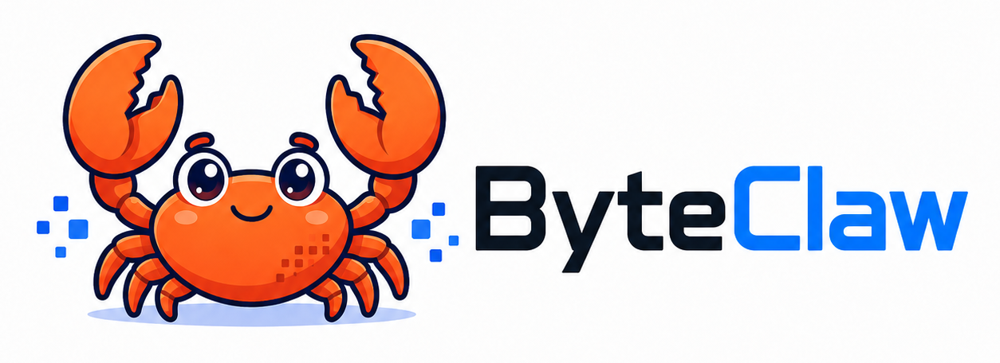

<div align="center">


<br>

# ByteClaw

### ByteClaw是一个能够自我进化的Agent Harness。

<br>


[快速开始](#-快速开始) ·
[核心功能](#-核心功能) ·
[工作原理](#-工作原理) ·
[开发计划](#-开发计划)

</div>

---

## 🦀 ByteClaw 是什么？


它能够读取整个代码仓库，理解项目结构，调用文件系统、终端、Git 和测试工具，并通过持续的：

```text
思考 → 执行 → 观察 → 修正
```

## 🚀 快速开始

项目需要 Python 3.10 或更高版本。安装依赖：

```bash
python -m pip install -e .
```

复制 `.env.example` 为 `.env`，填写 `OPENAI_API_KEY`，然后运行：

```bash
byteclaw "创建一个 hello.py 文件" --workspace ./workspace
```

省略 `--workspace` 时，ByteClaw 会自动创建 `./workspace`。

## ✨ 核心功能

- 所有文件路径在操作前都会验证，防止越出工作区
- 支持文件读取、写入和唯一文本片段替换
- 支持正则表达式、glob、大小写选项和结果数量限制
- 在工作区中执行 shell 命令，并对超时进程树进行终止
- 通过 LangChain `StructuredTool` 接入 `ChatOpenAI`

## ⚙️ 工作原理

CLI 创建工作区运行状态，将工具绑定到模型，然后持续处理模型的工具调用；
当模型不再请求工具时，输出最终结果。单次任务最多执行 25 轮工具调用。

